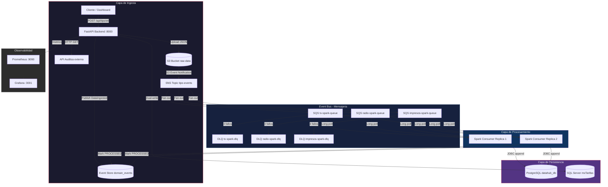
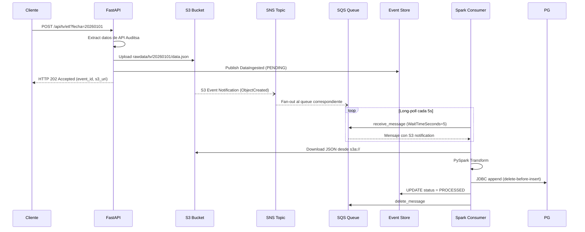
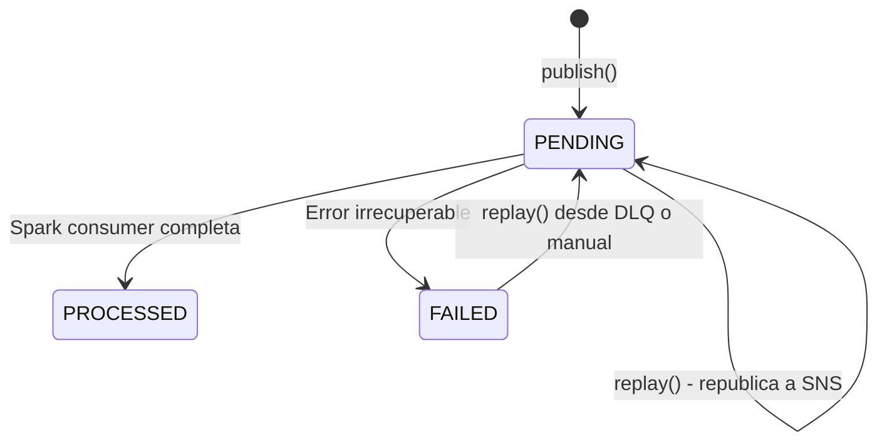
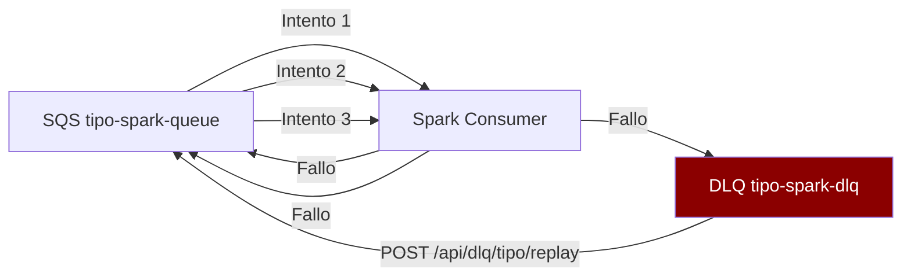
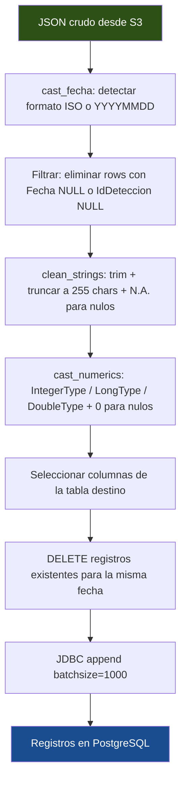
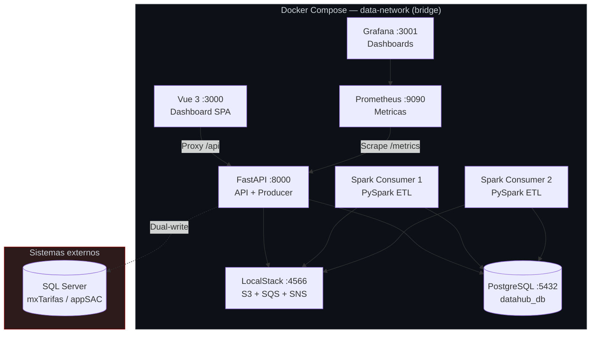
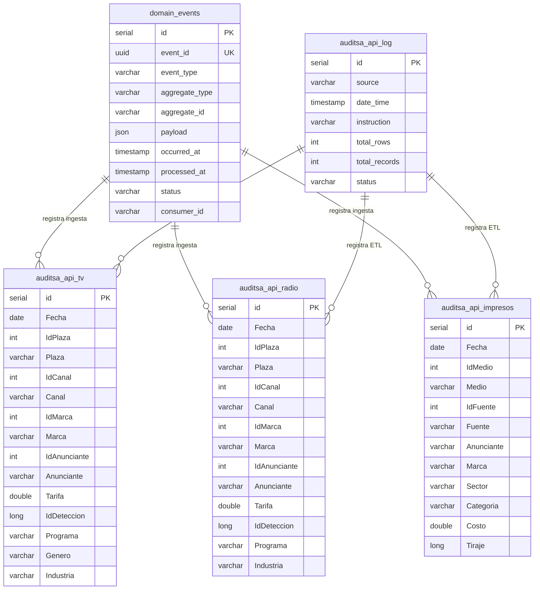
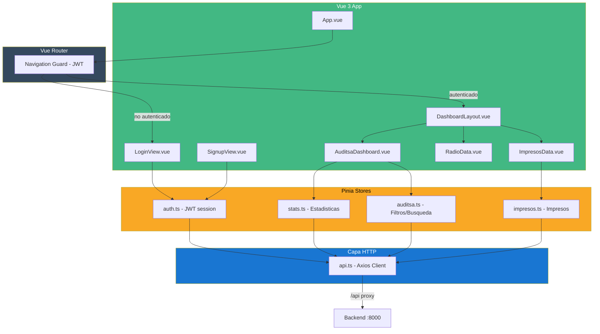
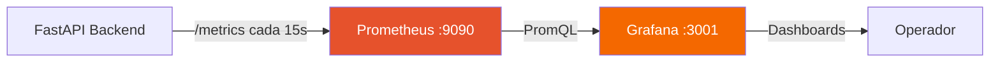

# EDA Data Ingest Hub

Pipeline de ingesta de datos publicitarios (TV, Radio, Impresos) construido sobre una **Arquitectura Event-Driven (EDA)**. Extrae datos de la API, los almacena en S3, los propaga vía SNS/SQS y los procesa con Apache Spark antes de cargarlos en PostgreSQL y SQL Server.

---

## Tabla de contenidos

- [Arquitectura general](#arquitectura-general)
- [Stack tecnologico](#stack-tecnologico)
- [Estructura del proyecto](#estructura-del-proyecto)
- [Patrones de diseno](#patrones-de-diseno)
- [Flujo de ingesta detallado](#flujo-de-ingesta-detallado)
- [Algoritmos y logica de transformacion](#algoritmos-y-logica-de-transformacion)
- [Distribucion de sistemas](#distribucion-de-sistemas)
- [Base de datos](#base-de-datos)
- [API REST](#api-rest)
- [Frontend (Dashboard)](#frontend-dashboard)
- [Observabilidad](#observabilidad)
- [Inicio rapido](#inicio-rapido)

---

## Arquitectura general

El sistema implementa un modelo **productor-consumidor** con propagacion asincrona de eventos. El backend (FastAPI) actua como productor: extrae datos de la API externa, los persiste en S3 y publica eventos de dominio. Los consumidores (Apache Spark) procesan los datos de forma independiente y paralela. La escritura dual a SQL Server garantiza disponibilidad de los datos en los sistemas corporativos existentes.



### Diagrama ASCII (alternativa sin Mermaid)

```
┌─────────────────────────────────────────────────────────────────────────┐
│                          CAPA DE INGESTA                                │
│                                                                         │
│   Cliente  ──►  POST /api/{tipo}/etl  ──►  FastAPI Backend              │
│                                                  │                      │
│                              ┌───────────────────┤                      │
│                              ▼                   ▼                      │
│                    ETL Service              S3 Service                  │
│                  (Extract + Load)     upload raw/{tipo}/{fecha}/        │
│                              │          data.json a S3                  │
│                              │                   │                      │
│                              ▼                   ▼                      │
│                    PostgreSQL (directo)   SNS Topic                     │
│                    auditsa_api_{tipo}   {tipo}-events                   │
│                    SQL Server (dual)                                    │
│                                                  │                      │
│                                         ┌────────┴────────┐             │
│                                         ▼                 ▼             │
│                                  SQS Main Queue      Event Store        │
│                               {tipo}-spark-queue   domain_events        │
│                                    (max 3 intentos)                     │
│                                         │                               │
│                                         │ fallo × 3                     │
│                                         ▼                               │
│                                  SQS Dead Letter                        │
│                                  {tipo}-spark-dlq                       │
└─────────────────────────────────────────────────────────────────────────┘

┌─────────────────────────────────────────────────────────────────────────┐
│                       CAPA DE PROCESAMIENTO                             │
│                                                                         │
│   Spark Consumer (x2 replicas)                                          │
│     └── Long-poll SQS (5s)                                              │
│           └── Descarga JSON de S3                                       │
│                 └── Transforma con PySpark                              │
│                       └── JDBC append → PostgreSQL                      │
│                             └── Marca domain_events PROCESSED           │
└─────────────────────────────────────────────────────────────────────────┘
```

---

## Stack tecnologico

| Capa | Tecnologia | Version | Proposito |
|------|-----------|---------|-----------|
| **API** | FastAPI | 0.115+ | API REST, productor de eventos, orquestador ETL |
| **ORM** | SQLAlchemy | 2.0+ | Modelos ORM, sesiones multi-BD |
| **Validacion** | Pydantic | 2.10+ | Esquemas de request/response |
| **Servidor** | Uvicorn | latest | Servidor ASGI con hot-reload |
| **Procesamiento** | Apache Spark (PySpark) | 3.5.0 | ETL distribuido, transformaciones batch |
| **Base de datos** | PostgreSQL | 15-alpine | Data warehouse principal |
| **Base de datos** | SQL Server | externo | Dual-write: mxTarifas (datos), appSAC (usuarios/cuentas) |
| **Object Storage** | S3 (LocalStack) | latest | Almacenamiento de datos crudos (JSON) |
| **Mensajeria** | SNS + SQS (LocalStack) | latest | Event Bus, colas de procesamiento, DLQ |
| **Frontend** | Vue 3 + TypeScript | 3.5+ | Dashboard SPA de visualizacion |
| **UI Framework** | PrimeVue + Tailwind CSS | 4.5+ / 4.2+ | Componentes y estilos |
| **State Mgmt** | Pinia | 2.3+ | Estado centralizado del frontend |
| **Build Tool** | Vite | 7.3+ | Dev server con HMR y build de produccion |
| **Metricas** | Prometheus | latest | Recoleccion de metricas del backend |
| **Dashboards** | Grafana | latest | Visualizacion de metricas operativas |
| **Seguridad** | python-jose + passlib | latest | JWT (HS256) + bcrypt |
| **Rate Limiting** | slowapi | latest | Limite de 200 req/min |
| **Orquestacion** | Docker Compose | v2+ | Levantamiento de todo el stack |

---

## Estructura del proyecto

```
EDA_Data_Ingest/
├── docker-compose.yml              # Orquestacion del stack completo (7 servicios)
├── README.md                        # Este archivo
│
├── backend/                         # FastAPI — API de ingesta y Event Store
│   ├── main.py                      # App principal: routers, startup, indexes, prewarm cache
│   ├── Dockerfile                   # Python 3.13 slim
│   ├── requirements.txt             # Dependencias Python
│   │
│   ├── config/
│   │   ├── settings.py              # Pydantic BaseSettings (40+ env vars)
│   │   ├── database.py              # SQLAlchemy engines: PostgreSQL + SQL Server (x2)
│   │   ├── auth.py                  # JWT + bcrypt (tokens, roles, allowed_media)
│   │   ├── limiter.py               # Rate limiting (200 req/min)
│   │   └── schemas.py               # Schemas de validacion de requests
│   │
│   ├── models/                      # Modelos ORM (SQLAlchemy)
│   │   ├── domain_events.py         # Event Store: tabla domain_events
│   │   ├── api_auditsa_tv.py        # Spots de TV (~53 columnas)
│   │   ├── api_auditsa_radio.py     # Spots de Radio (~53 columnas)
│   │   ├── api_auditsa_impresos.py  # Avisos impresos (~19 columnas)
│   │   ├── api_auditsa_logs.py      # Logs de ejecucion ETL
│   │   ├── api_auditsa_media_master_library.py  # Catalogo de versiones/spots
│   │   ├── api_auditsa_media_master_totals.py   # Totales agregados por periodo
│   │   ├── catalogues_user_role.py  # Usuarios y roles (PostgreSQL)
│   │   ├── catalogues_accounts.py   # Cuentas (PostgreSQL)
│   │   ├── sqlserver_auditsa.py     # Modelos SQL Server mxTarifas
│   │   └── sqlserver_users.py       # Modelos SQL Server appSAC
│   │
│   ├── routers/                     # Endpoints REST (15 archivos)
│   │   ├── auth.py                  # /auth/token, /auth/register, /auth/me, /auth/accounts
│   │   ├── tv.py                    # /api/tv/* — ETL, stats, CRUD
│   │   ├── radio.py                 # /api/radio/* — ETL, stats, CRUD
│   │   ├── impresos.py              # /api/impresos/* — ETL, stats, CRUD
│   │   ├── events.py                # /api/events/* — Event Store queries, replay
│   │   ├── dlq.py                   # /api/dlq/* — Dead Letter Queue management
│   │   ├── autocomplete.py          # /api/autocomplete — filtros en cascada cross-tabla
│   │   ├── records.py               # /api/records/{tipo} — registros paginados
│   │   ├── export.py                # /api/export/{tipo} — exportacion a Excel
│   │   ├── stats.py                 # /api/stats/summary — stats + top-marcas batch
│   │   ├── admin.py                 # /admin/* — init SQL Server, cache refresh
│   │   ├── health.py                # /health/sqlserver — health check SQL Server
│   │   ├── media_master_library.py  # /api/media-master-library — catalogo de versiones
│   │   └── media_master_totals.py   # /api/media-master-totals — totales por periodo
│   │
│   ├── services/                    # Logica de negocio (18 archivos)
│   │   ├── auditsa_api_services.py  # Cliente HTTP para API Auditsa
│   │   ├── auditsa_tv_etl_service.py             # Orquestacion ETL TV
│   │   ├── auditsa_radio_etl_service.py          # Orquestacion ETL Radio
│   │   ├── auditsa_impresos_etl_service.py       # Orquestacion ETL Impresos
│   │   ├── auditsa_media_master_library_etl_service.py  # ETL catalogo maestro
│   │   ├── auditsa_media_master_totals_etl_service.py   # ETL totales maestro
│   │   ├── auditsa_data_processor.py             # Validacion y procesamiento de datos
│   │   ├── s3_service.py            # Wrapper S3 (upload/download/delete)
│   │   ├── sqs_service.py           # Wrapper SQS (send/receive/delete)
│   │   ├── sns_service.py           # Wrapper SNS (publish a topics)
│   │   ├── event_store_service.py   # CRUD Event Store + idempotencia
│   │   ├── dlq_service.py           # Gestion de Dead Letter Queues
│   │   ├── log_service.py           # Logging ETL a base de datos
│   │   ├── stats_cache_service.py   # Cache in-memory con TTL de 10 min
│   │   ├── session_log_service.py   # Audit log de queries (SELECT, EXPORT)
│   │   ├── account_sectors_service.py  # Medios permitidos por cuenta
│   │   ├── sqlserver_write_service.py  # Escritura dual a SQL Server mxTarifas
│   │   └── string_normalizer.py     # Normalizacion de strings (acentos, case)
│   │
│   └── tests/                       # Tests automatizados
│       ├── conftest.py              # Fixtures pytest
│       ├── test_auth.py             # Tests de autenticacion
│       ├── test_health.py           # Tests de health check
│       ├── test_tv.py               # Tests de endpoints TV
│       └── test_errors.py           # Tests de manejo de errores
│
├── frontend/                        # Vue 3 + TypeScript — Dashboard SPA
│   ├── Dockerfile                   # Node.js 25 alpine + pnpm
│   ├── package.json                 # Dependencias (Vue, Pinia, PrimeVue, Tailwind, Chart.js)
│   ├── vite.config.ts               # Dev server + proxy /api → backend:8000
│   ├── tsconfig.*.json              # Configuracion TypeScript
│   └── src/
│       ├── main.ts                  # Bootstrap (Pinia, PrimeVue, Vue Router)
│       ├── App.vue                  # Layout raiz
│       ├── style.css                # Estilos globales
│       ├── router/
│       │   └── index.ts             # Vue Router — rutas protegidas por JWT
│       ├── layouts/
│       │   └── DashboardLayout.vue  # Layout con sidebar
│       ├── services/
│       │   └── api.ts               # Cliente HTTP (Axios) + interfaces TS
│       ├── stores/
│       │   ├── auth.ts              # Store de autenticacion (JWT, login/logout)
│       │   ├── stats.ts             # Store de estadisticas (con retry backoff)
│       │   ├── auditsa.ts           # Store de busqueda/filtros cross-tabla
│       │   └── impresos.ts          # Store especifico de impresos
│       └── views/
│           ├── LoginView.vue        # Formulario de autenticacion JWT
│           ├── SignupView.vue        # Registro de nuevos usuarios
│           ├── AuditsaDashboard.vue # Dashboard principal (filtros + charts)
│           ├── ImpresosData.vue     # Vista de registros impresos
│           └── RadioData.vue        # Vista de registros radio
│
├── spark-jobs/                      # PySpark Consumer
│   ├── consumer.py                  # Loop: SQS → S3 → Transform → JDBC → Event Store
│   └── README.md
│
├── localstack_setup/                # Aprovisionamiento AWS local
│   ├── init.sh                      # Crea S3, SNS topics, SQS queues, DLQs, suscripciones
│   ├── verify_setup.sh              # Verifica que todos los recursos existen
│   └── README.md
│
├── monitoring/                      # Observabilidad
│   ├── prometheus/
│   │   └── prometheus.yml           # Scrape backend:8000/metrics cada 15s
│   └── grafana/
│       ├── provisioning/
│       │   ├── datasources/         # Prometheus datasource auto-provisionado
│       │   └── dashboards/          # Dashboard provisioning
│       └── dashboards/
│           └── eda-ingestion-monitor.json  # Dashboard pre-configurado
│
└── SQL/                             # Scripts SQL auxiliares
    ├── fn_radio_subtitulo_default.sql   # Funcion PostgreSQL
    └── trg_radio_subtitulo_default.sql  # Trigger PostgreSQL
```

---

## Patrones de diseno

### 1. Event-Driven Architecture (EDA)

Patron central del sistema. Los componentes se comunican exclusivamente mediante eventos asincronos, lo que permite desacoplamiento total entre productores y consumidores.



### 2. Event Sourcing (Event Store)

Todos los eventos de dominio se registran como hechos inmutables en la tabla `domain_events`. Esto proporciona:

- **Auditoria completa**: registro de todo lo que ocurrio en el sistema.
- **Replay**: capacidad de reprocesar eventos fallidos.
- **Trazabilidad**: que replica proceso cada evento y cuando.



**Modelo de datos del Event Store:**

| Campo | Tipo | Descripcion |
|-------|------|-------------|
| `id` | SERIAL PK | ID autoincremental |
| `event_id` | UUID UNIQUE | Identificador unico del evento |
| `event_type` | VARCHAR | DataIngested / DataProcessed / DataDeleted |
| `aggregate_type` | VARCHAR | tv / radio / impresos |
| `aggregate_id` | VARCHAR | Fecha YYYYMMDD |
| `payload` | JSON | Datos del evento (s3_key, records, etc.) |
| `occurred_at` | TIMESTAMP | Momento en que ocurrio (inmutable) |
| `processed_at` | TIMESTAMP | Momento en que fue procesado |
| `status` | VARCHAR | PENDING / PROCESSED / FAILED |
| `consumer_id` | VARCHAR | Hostname de la replica que proceso |

### 3. Dual-Write (PostgreSQL + SQL Server)

Los datos de ingesta se escriben de forma sincrona en PostgreSQL (data warehouse principal) y de forma resiliente (graceful degradation) en SQL Server mxTarifas para disponibilidad en sistemas corporativos. El registro y login de usuarios tambien utiliza dual-write hacia SQL Server appSAC.

| Base de datos | Proposito | Tipo de escritura |
|--------------|-----------|-------------------|
| **PostgreSQL datahub_db** | Data warehouse principal, Event Store, usuarios | Sincrona (commit obligatorio) |
| **SQL Server mxTarifas** | Replica de datos TV/Radio/Impresos/MediaMaster | Asincrona resiliente (fallo no bloquea) |
| **SQL Server appSAC** | Catalogo de cuentas, usuarios corporativos | Asincrona resiliente |

### 4. Idempotencia

El sistema garantiza que operaciones repetidas producen el mismo resultado sin efectos secundarios:

| Componente | Mecanismo | Implementacion |
|-----------|-----------|----------------|
| **Event Store** | Indice parcial unico | `UNIQUE (event_type, aggregate_type, aggregate_id) WHERE status='PENDING'` |
| **Spark Consumer** | Delete-before-insert | `DELETE FROM tabla WHERE Fecha = ? → INSERT` |
| **ETL Service** | Verificacion previa | Consulta si ya existen datos antes de re-procesar |

### 5. Dead Letter Queue (DLQ)

Mensajes que fallan 3 veces consecutivas en SQS son movidos automaticamente a una cola DLQ dedicada. Esto evita que mensajes corruptos bloqueen el procesamiento.



### 6. Producer-Consumer con Fan-out

SNS actua como Event Bus central. Cada topic (`tv-events`, `radio-events`, `impresos-events`) distribuye mensajes a las colas SQS suscritas, permitiendo multiples consumidores en paralelo.

### 7. Cache con Pre-calentamiento

Las tablas principales contienen millones de registros (~20M en TV, ~15M en Radio). Las consultas de estadisticas tardarian ~40s sin cache. El sistema implementa:

- **Pre-warming al startup**: hilo en background calcula stats de las 3 tablas al iniciar.
- **Cache in-memory con TTL de 10 minutos**: respuestas instantaneas para el usuario.
- **Invalidacion manual**: `POST /admin/cache/refresh` permite refrescar ante ingestas urgentes.

### 8. Control de acceso por cuenta (allowed_media)

El token JWT incluye el campo `allowed_media` que limita los tipos de medio (tv/radio/impresos) a los que cada cuenta tiene acceso. Los endpoints `/api/records/{tipo}` y `/api/stats/summary` respetan este control.

### 9. Repository Pattern y Service Layer

Los modelos ORM encapsulan el acceso a datos. La logica de negocio esta en servicios independientes (`ETLService`, `S3Service`, etc.), cada uno con responsabilidad unica y testeable en aislamiento.

---

## Flujo de ingesta detallado

### Diagrama de secuencia completo

```mermaid
sequenceDiagram
    actor U as Usuario / Scheduler
    participant FE as Vue Dashboard
    participant API as FastAPI :8000
    participant AUD as API Auditsa
    participant S3 as S3 raw-data
    participant ES as Event Store
    participant SNS as SNS Topic
    participant SQS as SQS Queue
    participant DLQ as Dead Letter Queue
    participant SP as Spark Consumer
    participant PG as PostgreSQL
    participant SS as SQL Server

    U->>FE: Solicita ingesta de fecha
    FE->>API: POST /api/tv/etl?fecha=20260315
    Note over API: Requiere JWT con rol admin

    rect rgb(40, 40, 70)
        Note over API,AUD: 1. EXTRACT
        API->>AUD: GET datos TV para 20260315
        AUD-->>API: JSON con registros
    end

    rect rgb(40, 70, 40)
        Note over API,S3: 2. STORE RAW DATA
        API->>S3: PUT rawdata/tv/20260315/data.json
        S3-->>API: OK
    end

    rect rgb(70, 40, 40)
        Note over S3,SQS: 3. EVENT PROPAGATION (automatico)
        S3--)SNS: S3 ObjectCreated notification
        SNS--)SQS: Fan-out a tv-spark-queue
    end

    rect rgb(60, 40, 70)
        Note over API,ES: 4. REGISTER DOMAIN EVENT
        API->>ES: INSERT DataIngested PENDING
        ES-->>API: event_id (UUID)
    end

    rect rgb(40, 50, 70)
        Note over API,SS: 5. DUAL-WRITE SQL SERVER
        API->>SS: INSERT en mxTarifas.dbo.auditsa_api_tv
        Note over SS: Graceful degradation si SS no disponible
    end

    API-->>FE: HTTP 202 {event_id, s3_uri, total_records}

    rect rgb(40, 60, 70)
        Note over SP,PG: 6. ASYNC PROCESSING (Spark)
        SP->>SQS: receive_message (long-poll 5s)
        SQS-->>SP: Mensaje con S3 path
        SP->>S3: Download JSON via s3a://
        SP->>SP: PySpark Transform (cast, clean, filter)
        SP->>PG: DELETE FROM tabla WHERE Fecha = 20260315
        SP->>PG: JDBC append (batchsize=1000)
        SP->>ES: UPDATE status = PROCESSED, consumer_id
        SP->>SQS: delete_message
    end

    alt Si Spark falla 3 veces
        SQS--)DLQ: Mensaje movido a DLQ
        Note over DLQ: Esperando replay manual
        U->>API: POST /api/dlq/tv/replay
        API->>DLQ: Leer mensajes
        API->>SQS: Re-enviar a cola principal
        API->>ES: Reset eventos a PENDING
    end
```



### Pasos del flujo

| Paso | Componente | Accion | Detalle |
|------|-----------|--------|---------|
| 1 | **FastAPI** | Extract | Llama a la API de Auditsa con la fecha solicitada (timeout: 300s) |
| 2 | **S3 Service** | Store | Sube el JSON crudo a `s3://raw-data/rawdata/{tipo}/{fecha}/data.json` |
| 3 | **S3 → SNS** | Notify | S3 Event Notification automatica al topic `{tipo}-events` |
| 4 | **SNS → SQS** | Fan-out | SNS reenvia a la cola `{tipo}-spark-queue` |
| 5 | **Event Store** | Register | Evento `DataIngested` con status `PENDING` en `domain_events` |
| 6 | **SQL Server** | Dual-write | Insercion resiliente en mxTarifas (no bloquea si SS no disponible) |
| 7 | **FastAPI** | Respond | HTTP 202 Accepted con `event_id` y `s3_uri` |
| 8 | **Spark** | Consume | Long-poll SQS, descarga JSON de S3 |
| 9 | **Spark** | Transform | Aplica transformaciones PySpark (cast, clean, filter) |
| 10 | **Spark** | Load | Delete-before-insert via JDBC a PostgreSQL |
| 11 | **Spark** | Complete | Marca evento como `PROCESSED` en Event Store |
| 12 | **DLQ** | Fallback | Si un mensaje falla 3 veces, cae al DLQ para retry manual |

---

## Algoritmos y logica de transformacion

### Pipeline de transformacion PySpark

El Spark Consumer aplica un pipeline secuencial de transformaciones a cada batch de datos:



#### 1. Casteo de fechas (`cast_fecha`)

Detecta automaticamente el formato de la fecha de entrada y lo normaliza:

```python
# Si contiene "T" → formato ISO: yyyy-MM-dd'T'HH:mm:ss
# Si no → formato compacto: yyyyMMdd
F.when(F.col("Fecha").contains("T"),
    F.to_date(F.col("Fecha"), "yyyy-MM-dd'T'HH:mm:ss"))
.otherwise(
    F.to_date(F.col("Fecha"), "yyyyMMdd"))
```

#### 2. Limpieza de strings (`clean_strings`)

Para cada columna de texto:
1. Cast a string
2. Substring a longitud maxima (255 para TV/Radio, 128 para Impresos)
3. Trim de espacios
4. Si el resultado es NULL o vacio → asignar `"N.A."`

#### 3. Casteo numerico (`cast_numerics`)

Columnas numericas se castean a sus tipos correctos con `0` como valor por defecto para nulos:

| Tipo | Columnas ejemplo | Valor default |
|------|-----------------|---------------|
| `IntegerType` | IdPlaza, IdCanal, IdMarca, DReal, DTeorica | 0 |
| `LongType` | IdVersion, IdDeteccion, Tiraje | 0L |
| `DoubleType` | Tarifa, Costo, Dimension | 0.0 |

#### 4. Deduplicacion de eventos (Event Store)

```python
# Buscar evento PENDING existente para el mismo agregado
existing = db.query(DomainEvent).filter_by(
    event_type=type,
    aggregate_type=agg_type,
    aggregate_id=agg_id,
    status='PENDING'
).first()

if existing:
    # Actualizar payload, retornar event_id existente (idempotente)
    existing.payload = new_payload
    return existing.event_id
else:
    # Crear nuevo evento con UUID
    return new_event_id
```

#### 5. Parseo de notificaciones S3 (envelope SNS)

El consumer debe desempaquetar un mensaje con doble envolvente:

```
SQS Message Body
  └── SNS Envelope (Type: "Notification")
        └── Message (string JSON)
              └── S3 Event Notification
                    └── Records[0].s3.object.key
                          └── "rawdata/{tipo}/{fecha}/data.json"
```

```python
# Extraer tipo y fecha del path S3
parts = s3_key.split("/")  # ["rawdata", "tv", "20260315", "data.json"]
tipo  = parts[1]   # "tv"
fecha = parts[2]   # "20260315"
```

#### 6. Autocomplete con filtros en cascada

El endpoint `/api/autocomplete` permite busqueda de texto en columnas especificas con filtros dependientes:

```
GET /api/autocomplete?field=marca&q=coca&anunciante=FEMSA&limit=20
```

- Usa indices GIN trigram (`pg_trgm`) para busquedas ILIKE rapidas
- Los filtros actuan como cascada: seleccionar un anunciante filtra las marcas disponibles
- Retorna valores distintos con conteo de ocurrencias

---

## Distribucion de sistemas

### Topologia de servicios (Docker Compose)



### Tabla de servicios

| Servicio | Imagen | Puerto | Rol | Dependencias |
|----------|--------|--------|-----|-------------|
| `localstack` | localstack/localstack:latest | 4566 | Simula AWS: S3 + SQS + SNS | — |
| `db` | postgres:15-alpine | 5432 | Base de datos principal | — |
| `backend` | Dockerfile local (Python 3.13) | 8000 | API REST + productor de eventos | db, localstack |
| `frontend` | Dockerfile local (Node.js 25) | 3000 | Dashboard de visualizacion | backend |
| `spark-processor` | apache/spark:3.5.0 | — | Consumer EDA (2 replicas) | localstack, db |
| `prometheus` | prom/prometheus:latest | 9090 | Recoleccion de metricas | — |
| `grafana` | grafana/grafana:latest | 3001 | Visualizacion de metricas | prometheus |

### Escalamiento horizontal

El componente `spark-processor` esta configurado con `deploy.replicas: 2`. Cada replica:
- Tiene un `consumer_id` unico basado en su hostname.
- Compite por mensajes en las mismas colas SQS (competing consumers).
- Puede escalarse de 2 a N replicas cambiando `replicas` en `docker-compose.yml`.

```yaml
spark-processor:
  deploy:
    replicas: 2  # Cambiar a 3, 5, etc. segun capacidad
```

### Recursos AWS (LocalStack)

El script `localstack_setup/init.sh` crea automaticamente al iniciar:

| Recurso | Nombre | Proposito |
|---------|--------|-----------|
| S3 Bucket | `raw-data` | Almacena JSONs crudos en `rawdata/{tipo}/{fecha}/` |
| SNS Topic | `tv-events` | Event Bus para datos de TV |
| SNS Topic | `radio-events` | Event Bus para datos de Radio |
| SNS Topic | `impresos-events` | Event Bus para datos de Impresos |
| SQS Queue | `tv-spark-queue` | Cola principal Spark TV (maxReceiveCount: 3) |
| SQS Queue | `radio-spark-queue` | Cola principal Spark Radio (maxReceiveCount: 3) |
| SQS Queue | `impresos-spark-queue` | Cola principal Spark Impresos (maxReceiveCount: 3) |
| SQS DLQ | `tv-spark-dlq` | Dead Letter Queue TV |
| SQS DLQ | `radio-spark-dlq` | Dead Letter Queue Radio |
| SQS DLQ | `impresos-spark-dlq` | Dead Letter Queue Impresos |
| S3 Notification | `ObjectCreated:*` → SNS | Trigger automatico al subir archivos |

---

## Base de datos

### Esquema de tablas



### Tablas

| Tabla | Registros aprox. | Descripcion |
|-------|-----------------|-------------|
| `auditsa_api_tv` | ~20M | Spots de television (~53 columnas) |
| `auditsa_api_radio` | ~15M | Spots de radio (~53 columnas, mismo esquema que TV) |
| `auditsa_api_impresos` | variable | Avisos impresos (~19 columnas) |
| `auditsa_api_media_master_library` | variable | Catalogo de versiones/spots Auditsa |
| `auditsa_api_media_master_totals` | variable | Totales agregados por periodo |
| `auditsa_api_log` | miles | Logs de ejecucion ETL (RECORDING → SUCCESS) |
| `domain_events` | miles | Event Store inmutable (PENDING → PROCESSED / FAILED) |
| `catalogue_users` | decenas | Usuarios registrados (PostgreSQL) |
| `catalogue_roles` | pocos | Roles: admin, reader, standard |

### Estrategia de indexacion

Las tablas se crean automaticamente al iniciar (`Base.metadata.create_all()`). Los indices se crean en un hilo en background durante el startup:

| Tipo de indice | Columna(s) | Proposito |
|---------------|-----------|-----------|
| **B-tree** | `Fecha` (3 tablas) | WHERE BETWEEN, GROUP BY, MIN/MAX |
| **Compuesto** | `(Fecha, Marca, Anunciante, Tarifa/Costo)` | Top marcas por inversion (Index-Only Scan) |
| **GIN trigram** | `Anunciante, Marca, Localidad, TipoMedio, Medio, Submarca, Sector, Categoria, Fuente, Industria` | Autocomplete ILIKE rapido |
| **Parcial unico** | `(event_type, aggregate_type, aggregate_id) WHERE status='PENDING'` | Idempotencia en Event Store |

### Optimizacion de PostgreSQL

El contenedor usa parametros optimizados via `docker-compose.yml`:

```
max_wal_size=2GB                    # WAL mas grande para menos checkpoints
checkpoint_completion_target=0.9    # Checkpoints graduales
shared_buffers=256MB                # Buffer compartido
effective_cache_size=1GB            # Estimacion de cache del OS
```

---

## API REST

### Autenticacion

```
POST /auth/token
  Body: { username, password }
  Response: { access_token, token_type, role, username, allowed_media }
```

| Usuario | Origen | Rol | Permisos |
|---------|--------|-----|---------|
| `admin` (env) | `.env` | admin | ETL + lectura + delete + admin |
| `reader` (env) | `.env` | reader | Solo lectura |
| Usuarios registrados | PostgreSQL / SQL Server | standard | Lectura segun `allowed_media` |

Los tokens JWT (HS256) tienen validez de 24 horas y deben enviarse como `Authorization: Bearer <token>`.

El campo `allowed_media` en el token lista los tipos de medio accesibles para la cuenta del usuario (ej: `["tv", "radio"]`). Los administradores tienen acceso a todos los medios.

### Endpoints principales

#### Autenticacion y usuarios

| Metodo | Endpoint | Descripcion | Rol |
|--------|----------|-------------|-----|
| `POST` | `/auth/token` | Obtener token JWT | — |
| `POST` | `/auth/register` | Registrar nuevo usuario (dual-write PG + SS) | — |
| `GET` | `/auth/accounts` | Lista de cuentas disponibles para registro | — |
| `GET` | `/auth/me` | Datos del usuario autenticado | cualquiera |

#### Datos (TV / Radio / Impresos)

| Metodo | Endpoint | Descripcion | Rol |
|--------|----------|-------------|-----|
| `POST` | `/api/{tipo}/etl?fecha=YYYYMMDD` | Ingesta de una fecha | admin |
| `POST` | `/api/{tipo}/etl/range` | Ingesta de rango (paralelo, 5 workers) | admin |
| `GET` | `/api/{tipo}/stats` | Estadisticas globales (cached) | reader+ |
| `GET` | `/api/{tipo}/top-marcas` | Top N marcas por inversion | reader+ |
| `GET` | `/api/{tipo}/top-marcas/range` | Top marcas en rango con filtros | reader+ |
| `GET` | `/api/{tipo}/status/range` | Stats por fecha dentro de rango | reader+ |
| `GET` | `/api/{tipo}/status/{fecha}` | Estado de ingesta para una fecha | reader+ |
| `GET` | `/api/{tipo}/{fecha}` | Datos crudos de la API para una fecha | reader+ |
| `DELETE` | `/api/{tipo}/{fecha}` | Elimina datos de S3 + PostgreSQL | admin |

#### Registros y Exportacion

| Metodo | Endpoint | Descripcion | Rol |
|--------|----------|-------------|-----|
| `GET` | `/api/records/{tipo}` | Registros paginados con filtros (page, page_size) | reader+ |
| `GET` | `/api/export/{tipo}` | Datos filtrados para exportacion Excel (max 1M filas) | reader+ |

#### Stats batch

| Metodo | Endpoint | Descripcion | Rol |
|--------|----------|-------------|-----|
| `GET` | `/api/stats/summary` | Stats + top-10 marcas + top-10 sectores de los 3 medios en 1 llamada (cached, filtra por allowed_media) | reader+ |

#### Media Master

| Metodo | Endpoint | Descripcion | Rol |
|--------|----------|-------------|-----|
| `GET` | `/api/media-master-library/stats` | Estadisticas del catalogo | reader+ |
| `POST` | `/api/media-master-library/etl` | Ingesta del catalogo maestro | admin |
| `GET` | `/api/media-master-totals/stats` | Estadisticas de totales | reader+ |
| `POST` | `/api/media-master-totals/etl` | Ingesta de totales por periodo | admin |

#### Event Store

| Metodo | Endpoint | Descripcion |
|--------|----------|-------------|
| `GET` | `/api/events/` | Lista eventos (filtros: tipo, fecha, event_type, status) |
| `GET` | `/api/events/pending` | Eventos en estado PENDING |
| `GET` | `/api/events/{event_id}` | Detalle de un evento |
| `POST` | `/api/events/{event_id}/replay` | Republica evento a SNS + reset a PENDING |

#### Dead Letter Queue

| Metodo | Endpoint | Descripcion |
|--------|----------|-------------|
| `GET` | `/api/dlq/` | Stats globales de todas las DLQs |
| `GET` | `/api/dlq/{tipo}` | Lista mensajes en DLQ |
| `POST` | `/api/dlq/{tipo}/replay` | Mueve mensajes de DLQ a cola principal |
| `DELETE` | `/api/dlq/{tipo}` | Purga la DLQ del tipo indicado |

#### Administracion

| Metodo | Endpoint | Descripcion | Rol |
|--------|----------|-------------|-----|
| `POST` | `/admin/sqlserver/init-tables` | Crea tablas de ingesta en SQL Server mxTarifas | admin |
| `POST` | `/admin/cache/refresh` | Invalida y recalcula el cache de stats | admin |

#### Utilidades

| Metodo | Endpoint | Descripcion |
|--------|----------|-------------|
| `GET` | `/api/autocomplete` | Autocompletado cross-tabla con filtros en cascada |
| `GET` | `/health/sqlserver` | Health check SQL Server externo |
| `GET` | `/metrics` | Metricas Prometheus |

---

## Frontend (Dashboard)

El frontend es una SPA construida con **Vue 3**, **TypeScript**, **PrimeVue** y **Tailwind CSS**. Utiliza **Pinia** como store centralizado, **Vue Router** para navegacion protegida y **Axios** como cliente HTTP.

### Arquitectura del frontend



### Caracteristicas

- **Autenticacion JWT**: login con Bearer token, guard de navegacion, logout y renovacion de sesion.
- **Registro de usuarios**: formulario de alta con seleccion de cuenta desde SQL Server appSAC.
- **Filtros en cascada**: seleccion de anunciante filtra marcas, localidades, etc.
- **Retry con backoff exponencial**: el store reintenta (2s, 4s, 8s) si el backend no esta listo.
- **Proxy de desarrollo**: Vite proxea `/api/*` a `http://backend:8000` en desarrollo.
- **PrimeVue**: tablas paginadas, graficos, selectores, componentes accesibles.
- **Control por allowed_media**: el store filtra los tipos de medio segun el token del usuario.

---

## Observabilidad

### Stack de monitoreo



| Componente | Descripcion |
|-----------|-------------|
| **prometheus-fastapi-instrumentator** | Expone metricas en `/metrics` automaticamente |
| **Prometheus** | Scrape cada 15 segundos del backend |
| **Grafana** | Dashboard pre-provisionado `eda-ingestion-monitor.json` |

### Metricas expuestas

- Latencia por endpoint (histograma)
- Conteo de requests por metodo y status
- Metricas de proceso (CPU, memoria)

### Acceso

| Interfaz | URL | Credenciales |
|----------|-----|-------------|
| Grafana | http://localhost:3001 | admin / admin123 |
| Prometheus | http://localhost:9090 | — |

---

## Inicio rapido

### Prerrequisitos

- **Docker Desktop** con soporte para `deploy.replicas` (Docker Swarm **no** requerido)
- Variables de entorno de Auditsa (en `.env` o en el compose):

```env
AUDITSA_URL=https://...
AUDITSA_TOKEN=<token>
AUDITSA_CLID=<client_id>
```

- (Opcional) Acceso a SQL Server externo para dual-write:

```env
SQLSERVER_HOST=<host>
SQLSERVER_USER=<user>
SQLSERVER_PASSWORD=<password>
SQLSERVER_DB_TARIFAS=mxTarifas
```

### Levantar el stack

```bash
docker compose up --build
```

> El contenedor `localstack` ejecuta automaticamente `init.sh` al arrancar, creando todos los recursos AWS necesarios (S3, SNS, SQS, DLQs, suscripciones y notificaciones).

### Inicializar tablas en SQL Server (opcional)

Si se tiene acceso a SQL Server, crear las tablas de destino:

```bash
curl -X POST http://localhost:8000/admin/sqlserver/init-tables \
  -H "Authorization: Bearer <admin_token>"
```

### Verificar recursos AWS locales

```bash
docker exec aws-local bash /etc/localstack/init/ready.d/verify_setup.sh
```

### Accesos

| Interfaz | URL |
|----------|-----|
| Frontend (Dashboard) | http://localhost:3000 |
| Backend (API Docs - Swagger) | http://localhost:8000/docs |
| Backend (Metricas) | http://localhost:8000/metrics |
| Prometheus | http://localhost:9090 |
| Grafana | http://localhost:3001 (admin / admin123) |
| LocalStack | http://localhost:4566 |

### Tipos de datos soportados

| Tipo | Endpoint base | Tabla PostgreSQL | Tabla SQL Server | Cola SQS | DLQ |
|------|--------------|-----------------|-----------------|----------|-----|
| Television | `/api/tv` | `auditsa_api_tv` | `dbo.auditsa_api_tv` | `tv-spark-queue` | `tv-spark-dlq` |
| Radio | `/api/radio` | `auditsa_api_radio` | `dbo.auditsa_api_radio` | `radio-spark-queue` | `radio-spark-dlq` |
| Impresos | `/api/impresos` | `auditsa_api_impresos` | `dbo.auditsa_api_impresos` | `impresos-spark-queue` | `impresos-spark-dlq` |
| Media Master Library | `/api/media-master-library` | `auditsa_api_media_master_library` | `dbo.auditsa_api_media_master_library` | — | — |
| Media Master Totals | `/api/media-master-totals` | `auditsa_api_media_master_totals` | `dbo.auditsa_api_media_master_totals` | — | — |

### Tests

```bash
cd backend
pytest tests/ -v
```

---

## Componentes documentados

| Directorio | README |
|-----------|--------|
| `backend/` | [backend/README.md](backend/README.md) |
| `backend/routers/` | [backend/routers/README.md](backend/routers/README.md) |
| `backend/services/` | [backend/services/README.md](backend/services/README.md) |
| `frontend/` | [frontend/README.md](frontend/README.md) |
| `spark-jobs/` | [spark-jobs/README.md](spark-jobs/README.md) |
| `localstack_setup/` | [localstack_setup/README.md](localstack_setup/README.md) |
| `monitoring/` | [monitoring/README.md](monitoring/README.md) |
